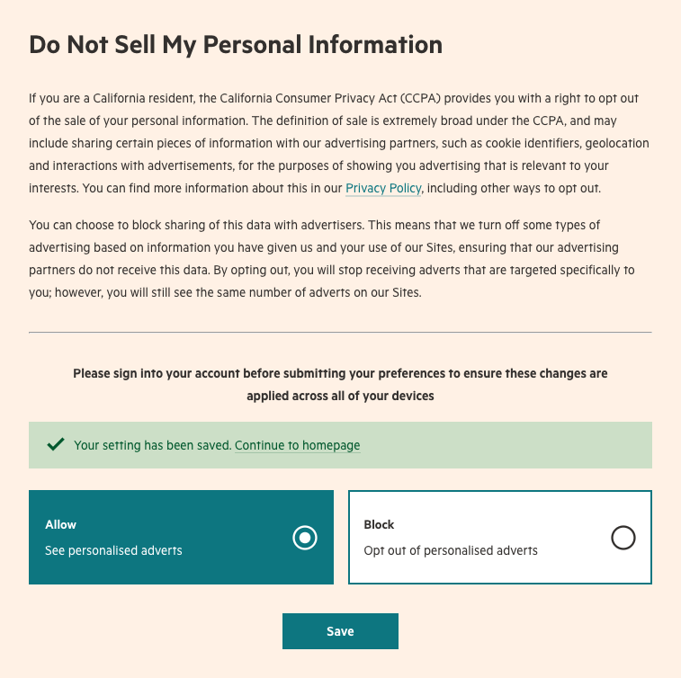

# x-privacy-manager

This module creates an interface giving users the ability to give or withhold consent to the sale of their data under the provisions of the CCPA (California Consumer Protection Act), as a first step towards the FT's journey towards a Unified Privacy solution.

It is rendered with Page Kit on FT.com at https://www.ft.com/preferences/privacy-ccpa as part of [`next-control-centre`](https://github.com/Financial-Times/next-control-centre) and rendered directly by the FT App. Additionally, it is intended to be embedded on pages curated by Specialist Titles



## Installation

This module is supported on Node 12 and is distributed on npm.

```bash
npm install --save @financial-times/x-privacy-manager
```

The [`x-engine`][engine] module is used to inject your chosen runtime into the component. Please read the `x-engine` documentation first if you are consuming `x-` components for the first time in your application.

[engine]: https://github.com/Financial-Times/x-dash/tree/HEAD/packages/x-engine


## Usage

### Properties

Feature                     | Type       | Notes
----------------------------|------------|-----------------------------------------------
`consentSource`             | string     | Name of the consuming app to be included in requests to Consent Proxy (e.g. "next-control-centre")
`consentProxyEndpoints`     | object     | Dictionary containing already-formed Consent Proxy Endpoints to use (including userId). It must include, at least, `consentProxyEndpoints.createOrUpdateRecord`
`consent`                   | boolean    | (optional) Any existing preference expressed by the user
`referrer`                  | string     | (optional) Used to provide a link back to the referring app's home page
`cookieDomain`              | string     | (optional) Specify the domain for the cookie set with the response from Consent Proxy (e.g. ".thebanker.com"). Will default to ".ft.com" if not provided
`legislation`               | string[]   | (optional) An array of the applicable legislation IDs
`onConsentSavedCallbacks`   | function[] | (optional) An array of callbacks to invoken after a successful request to Consent Proxy

A callback registered with `onConsentSavedCallbacks` will be executed with the following signature:
```js
customCallback(
  err: null | Error,
  {
    consent: boolean,
    payload: {
      formOfWordsId: string,
      consentSource: string,
      cookieDomain?: string,
      data: {
        ['behaviouralAds' | 'demographicAds' | 'programmaticAds']: {
          onsite: {
            status: boolean;
            lbi: boolean;
            source: string;
            fow: string;
          }
        }
      }
    }
  }
)
```

Callbacks are executed on regardless of the success (200 status) or failure of the call to the server,
so we encourage returning early if the value of the error is anything but `null`:

```js
function setCookie(err, {consent, payload}) {
  if(err) return;

  // Store the value of `consent`
  const uspString = `1Y${consent ? "N" : "Y"}N`;
  document.cookie = `usprivacy=${uspString}; max-age=${60 * 60 * 24 * 365}`;
}
```
